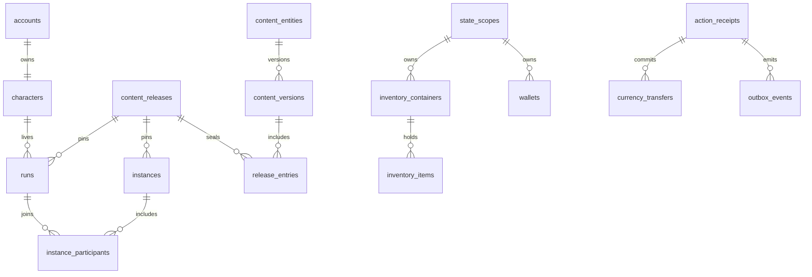

# Database foundation v1

Status: implemented shared infrastructure, not a completed catalog of all game mechanics. Reference decisions come from Core and Systems 01–46, especially Authority (23), Canon and ownership (46), Turns (01), Items (07), Ascension (10), and Economy (11). Synced design sources remain read-only outside the repository.

## Model and ownership

Migration 001 retains account, character, run, request receipts and the Turn ledger. Migration 002 adds 33 tables: immutable content, seven state scopes, progression and consumption, daily rollover, inventory custody, integer wallets and transfers, discovery, quest/effect instances, shared worlds/Guilds/events, encounter instances, run history, audit, outbox, durable jobs and flags. Migration 004 adds an item quantity ledger; migration 005 adds five authentication tables. Migration 006 adds the ordinary encounter journal and draw history. Migration 007 adds three authored item reward tables. Migration 008 adds seven basic combat/campaign tables. Migration 009 adds two routine crafting history tables. Migration 010 adds two durable item protection tables. Migration 011 adds three equipment history and projection tables. Migration 012 adds one permanent equipment binding history table. Migration 013 adds three saved equipment loadout and protection tables. Migration 014 adds three XP opening-balance, encounter-budget and award-history tables. Migration 015 adds two class-build history and projection tables. Migration 016 adds two subclass selection tables. Migration 017 adds two feat selection tables. Migration 018 adds one earned-attribute allocation table. The total with migration bookkeeping is 78 tables.



| Scope | Intended state | Lifetime |
|---|---|---|
| ACCOUNT | Codex knowledge, persistent storage/wealth, future mastery and entitlements | Survives lives |
| CHARACTER | Stable identity, character-level records | Survives lives |
| RUN | Build, progression, consumption, quests, current-world consequences | Archived at transition |
| INSTANCE | Encounter/party state, committed seed, snapshot and clocks | Explicit resolution or expiry |
| GUILD | Membership, shared property and treasury | Independent shared lifetime |
| EVENT | Contribution and claim windows under a pinned release | Explicit event lifecycle |
| WORLD | Shared event/world infrastructure | Independent shared lifetime |

Every scope has exactly one typed owner and a real foreign key. Scope IDs and owners cannot change; archived scopes cannot be reactivated. New runs and instances require sealed content. Nullable run release references only accommodate pre-foundation rows during upgrade; development seeding fills those references without resetting balances.

## Enforced invariants

**Actions.** Account identity comes from authentication, never payload input. Account-scoped request IDs bind to a canonical hash of type, parameters, revision and authorization source. Committed results survive application recreation. Earlier prototype hashes remain replayable through an explicit envelope version. An account lock precedes current-run mutation; ordered wallet/container locks and bounded deadlock retries protect shared operations. Handler work, receipt, audit and outbox commit together. A failed write costs nothing.

**Content.** Stable IDs have typed kinds. The publication service validates the common envelope, finite JSON, unique IDs, supported schema versions, complete dependencies and acyclic dependency graphs. Identity, revision and kind participate in the digest. Reusing a version or revision for different content fails. Sealing verifies the manifest against the actual entries. Definitions, entries and sealed releases cannot be edited or deleted, and retired IDs cannot be reused. Existing run rules, instance release, seed and RNG version cannot change silently. These are shared envelope checks; each gameplay module still needs its own mechanics schema.

**Knowledge.** Content queries require discovery and a release belonging to an account's run. They project only explicitly public fields; advanced fields require advanced knowledge. They do not expose mechanics or secrets. Instance queries require participation and omit seed and internal state. Future list/search/tool endpoints must apply the same filtering before counting or projecting hidden data.

**Inventory.** Definitions and physical instances are separate. A live row has one container, an exact release/revision, positive quantity, explicit binding and source. Instance items issue one unit. Grants, consumption and stack splitting/merging use an immutable quantity ledger; consumed identities persist at zero for history. Direct quantity changes, deletion and provenance edits fail. Binding must match actual account/run custody. Movement requires ownership of both containers, active scope, current-run legality and an immutable movement record. Special custody requires its own service. See [inventory accounting](inventory-accounting.md) for the typed grant contract, transaction authority and remaining equipment/crafting work.

**Currency.** Gold and fractional supporter units use integer minor units, never floating-point balances. Wallets start at zero; an immutable transfer row locks both wallets in UUID order and changes both balances atomically. Direct balance mutation and wallet identity changes fail. Ordinary wallets cannot go negative. Faucet/sink wallets balance issuance and destruction so totals remain conserved. Generic player Gold transfer is conservatively limited to Casual account wealth until Standard trade milestones are implemented. Payments, exchange fees, settlement and refunds are not enabled.

**Scoped state.** Each immutable, versioned key declares an owning module, allowed scope, JSON schema, valid default and reset policy. The internal write service checks all of these and optimistic revision. SQL also rejects a contract/scope mismatch. JSON value validation is enforced by the server service, not by a PostgreSQL JSON-schema extension. Do not write generic state directly from new routes. Substantial domains should use relational tables with their own constraints.

**Time and rollover.** Global epochs are explicit, immutable records supplied by a future scheduler. The service applies due epochs once per account, not once per run, preventing an Ascension replay. Gain is `max(0, min(grant, cap - Turns))`; overcap Turns are preserved. Active combat/encounter postpones refresh until resolution. Consumption and registered daily state reset in the same transaction, with Turn and audit entries. Effect instances declare an explicit clock; the foundation only expires run rollover effects. Other clocks and banked daily charges require the owning rules engine. No wall-clock regeneration is implemented.

**Encounters.** Ordinary solo encounter starts commit their Turn cost and pinned definition once. Named random draws and private checkpoints survive reconnects; terminal outcomes settle domain rewards in the same Action. Resolved history cannot reopen or be rewritten. See [encounter persistence](encounter-persistence.md) for the internal contract and the combat/loot/defeat handlers still required.

**Authored item loot.** Version 2 encounters reference validated, dependency-checked loot tables. Their exact reward plan commits at encounter creation, and victory issues that plan through immutable inventory grant links. Claims and history are append-only; SQL and audits reconcile every claimed group. See [authored item loot](authored-item-loot.md) for authority boundaries and remaining combat/economy work.

**Basic combat/campaign loop.** An opted-in basic solo ruleset resolves intents on the server, retains health and rounds, settles item/Gold rewards, performs explicit Home recovery, and requires final/prerequisite combat evidence for campaign Aftercore. The existing Ascension transition then archives the old life and preserves ordinary possessions/wealth. See [basic combat](basic-combat-loop.md) for prototype mechanics, legacy compatibility and the final tactical engine still required.

**Progression choices.** Starting attributes and native class allocation are authored and journaled, subclass eligibility uses native level five, and feat choices use authored milestones and prerequisites. Earned attribute allocations are an independent capped overlay on starting attributes and survive later class level-ups. These decisions require explicit owner intent outside active instances; Ascension retains old history and starts fresh choices. See [class progression](run-class-progression.md), [subclasses](subclass-persistence.md), [feats](feat-persistence.md), and [attribute growth](attribute-milestones.md). Full class/feat execution, derived statistics, proficiency and Mastery remain gameplay work.

**Run transition.** A victorious run enters `AFTERCORE` and remains playable. Only Aftercore runs with no active instances can transition; old lives become `ARCHIVED`, and abandoned lives have their own status. A partial unique index allows one current Active/Aftercore life per character. Prototype `COMPLETED` history upgrades to archived history. The old run scope is archived, progression restarts, remaining Turns and daily consumption are preserved, and account discoveries/social scopes remain. Ordinary items move into account Home storage; explicitly categorized materials use the Material Vault. Run-bound/system quest objects remain inaccessible in archived custody for provenance. Current-run Gold moves into persistent account wealth. The transition records immutable history and uses the same request replay protection. This is the storage/lifetime primitive: victory eligibility, Legacy rewards, setup choices, a complete Chronicle and the player-visible preview/confirmation still belong to the Ascension feature.

**Background work.** An Action commits an outbox row rather than sending an external message. The dispatcher atomically hands pending rows to durable jobs, each with a stable key. Claims use `SKIP LOCKED`, bounded attempts, expiring leases and fresh fencing tokens. An expired worker cannot complete a reclaimed job. Permanent failures become visible `FAILED` jobs. Future external handlers must use provider idempotency keys; database delivery alone does not make a remote side effect exactly once. Dispatch and workers are internal functions; no autonomous worker loop is enabled yet.

## Domain coverage and remaining work

Migration 003 hardens this foundation with named multi-leg currency settlement, stricter and renewable worker leases, outbox collision detection, immutable character/container ownership, terminal run transitions, deferred run/scope consistency, and foreign-key index coverage. The read-only `db:audit` command reconciles balances and ownership/lifetime invariants. See [release readiness](release-readiness.md) for the implementation boundaries and remaining launch gates.

The table below maps every design system to an existing foundation. It is an implementation boundary, not a claim that all features are done.

| Systems | Available foundation | Next owning-module work |
|---|---|---|
| Core; 23 Authority; 46 Canon | Actions, queries, transactions, scopes, versions, audit, migration and permissions | Real sessions, permission registry, public contracts and admin interfaces |
| 01 Turns; 02 Consumables | Turn ledger, rollover epochs, consumption and resource pools | Consumption/yield rules, banked daily charges, scheduler and challenge overlays |
| 03 Progression; 10 Ascension; 13 Aftercore | Reconciled XP, authored class/feat/attribute choices, subclass eligibility, storage transition and immutable history | Full feature execution, derived stats, Mastery/Legacy, special starts, respec and transition preview |
| 04 Combat; 05 Encounters; 25 Defeat; 26 Difficulty; 27 Monsters; 28 Loot; 29 Checks | Pinned instances, solo encounter checkpoints, committed costs, durable isolated RNG and atomic settlement | Authored tactical state, checks, reward budgets, loss/recovery and typed mechanics |
| 06 Quests | Typed quest identity, versioned graph snapshot and lifecycle state | Graph compiler, objectives, rewards and fail-forward transitions |
| 07 Items; 08 Crafting | Item custody/binding, exact definitions, materials storage, quantity ledger, grants/consumption and stack transfers | Equipment, binding transitions, protection/capacity, recipes/Focus, durability/evolution and commission escrow |
| 09 Helpers | Persistent/account and current-run/instance scopes | Companion/Familiar state, progression, slots and tactical behavior |
| 11 Economy; 17 Supporter economy | Wallets, atomic integer transfers and immutable provenance | Listings/order books, fees, market eligibility, provider settlement and fraud holds |
| 12 Guilds | Membership roles, Guild scope, vault/treasury building blocks | Fine-grained permissions, contribution budgets, withdrawals and campaigns |
| 14 Collections | Persistent discovery with knowledge-filtered projections | Collection credit, museums, appearances and hidden-denominator-safe queries |
| 15 Events | Shared world, event lifecycle, release snapshots and jobs | Claims, community counters, overlays and event scheduling |
| 16 UI/automation | Client-independent queries/Actions, source attribution and feature flags | Native/browser interfaces, bounded automation policies, subscriptions and accessibility |
| 18 World; 19 Home; 20 Cosmology; 21 Factions/law | Location/route content, world-time field, explicit scopes and effects | Travel graphs, housing facilities, prayer, standing, Heat and jurisdiction |
| 22 PvP | Pinned shared instances and participant records | Opt-in rules, normalization, deterministic defense, rankings and match records |
| 24 Effects | Definitions versus effect instances, source/stacks and explicit clocks | Stacking families, operations, triggers and complete expiry engine |
| 30 Stealth | Instance/scope state and knowledge projections | Observer awareness, identity, alerts and declared propagation |
| 31 Traps/puzzles | Content, instance state, RNG and effects | Components, bounded chains and solvability contracts |
| 32 Dungeons | Pinned instance/layout storage and rewards custody | Graph validation, checkpoints, generated layouts and reward banking |
| 33 Wilderness | World/route content, scopes and effects | Scouting, exposure and scoped repairs; rejected field camps stay excluded |
| 34 NPCs | NPC identity, scoped state and knowledge boundaries | Structured memories, obligations, schedules and consent |
| 35 Magic | Ability/effect content, resources and checks extension points | Spell/ritual schemas, concentration, counters, research and disclosure |
| 36 Martial | Ability/class identity and native progression | Techniques, loadouts, stances and approved observation learning |
| 37 Species/identity | Species content and account/run identity | Curated anatomy, fit, appearance and run setup |
| 38 Investigation | Quest state, discoveries and hidden content fields | Evidence/claims/credibility models and authored clue relationships |
| 39 Recreation | Activity instances, currency and reward extension points | Versioned minigame rules, opponents and bounded eligibility |
| 40 Cards | Card content, instance snapshots and item custody | Separate deterministic card engine, formats and collection semantics |
| 41 Taming | Familiar/monster identities, scoped knowledge and acquisition extension points | Capture contracts, Bond and current-run power |
| 42 Bosses/raids | Shared pinned instances and participation | Phase mechanics, contribution claims and boss resolution |
| 43 Classes/feats | Native class levels, subclass/feat choice histories and basic class/prior-feat prerequisites | Capability expressions, portability, signatures, loadouts and loop validation |
| 44 Narrative | Quest/world scopes, history and truth/knowledge separation | Campaign structure, approved consequence Actions and authored endings |
| 45 Balance | Immutable tuning entities and release manifests | Numerical schemas, simulations, budget tests and tuning curves |

All systems share the transaction/version/scope boundaries; feature-specific persistence should be added with the first complete interaction, after reviewing its Bible. No dormant speculative tables have been added for unimplemented mechanics.

## Administration and recovery

Migration 005 adds scoped device sessions, password/recovery storage, security epochs, persistent throttles and security history. HTTP Actions recheck session authority inside their transaction before replay. See [accounts and sessions](account-sessions.md) for the mode switch, private enrollment and remaining public identity requirements.

Start the private development stack with `bash scripts/server.sh start`. It starts PostgreSQL, applies append-only migrations, initializes missing development records, provisions `realms_app`, builds, and starts the loopback server. Existing Turns are preserved. Existing migrations must never change after application; subsequent schema changes use new numbered files.

The server role has no superuser, role/database creation, schema creation, temporary-table creation, content publication, migration edits, credential enrollment, account suspension or immutable-ledger update/delete privilege. Administration scripts use private .env; startup generates an owner-only .state/runtime.env excluding administration/test credentials for the HTTP process. Runtime configuration and SQL privilege checks reject administrative access. Both files remain under the same workstation OS identity; stronger production isolation remains required.

Readiness verifies every migration name/checksum and rejects missing, changed or newer schemas. Integration tests require `realms_test` and create disposable schemas. Test artifacts are removed through schema teardown rather than deleting immutable audit history. CI uses its own PostgreSQL service and never deploys here.

```bash
bash scripts/verify.sh
bash scripts/runtime.sh npm run db:permissions
bash scripts/database.sh backup
bash scripts/database.sh restore-check .state/backups/NAME.dump
```

The restore command creates a uniquely named disposable database, restores with error checking, verifies migration checksums, validated constraints and currency conservation, then removes only that database. It never replaces development data. Back up before any schema upgrade. To recover development data, stop the server, restore into a new database, verify it, then deliberately change the configured connection; destructive in-place restores are not automated.

Local backups are not protection against workstation loss. Independent backup storage, automatic retention, reboot startup, real account authentication, operational dashboards and public deployment remain separate operational work. Rootless PostgreSQL packages do not receive automatic OS package upgrades.
